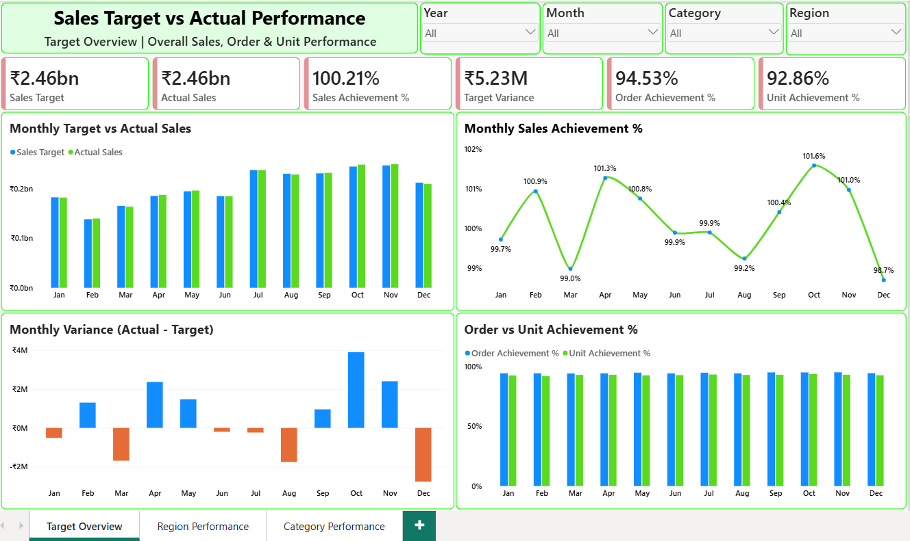
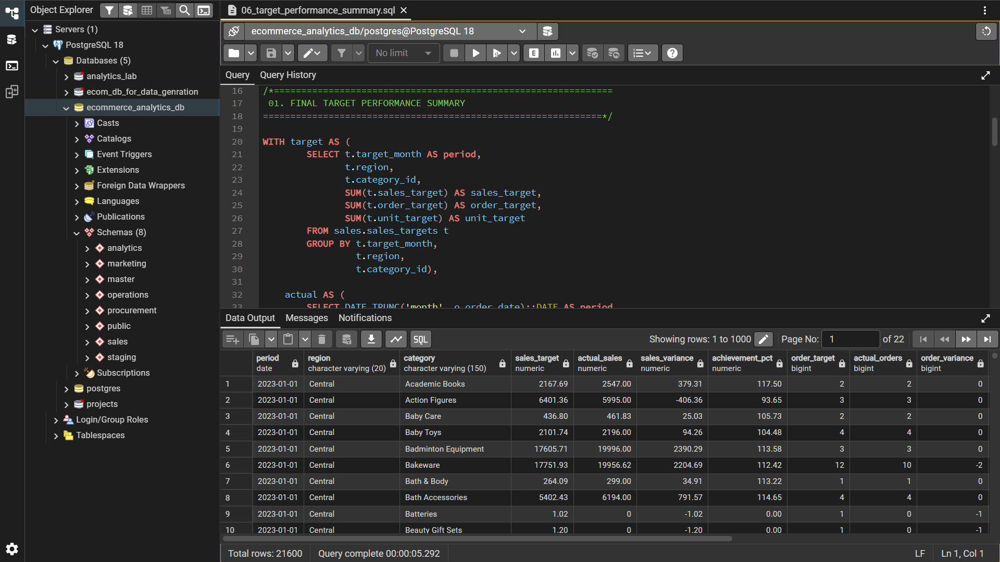
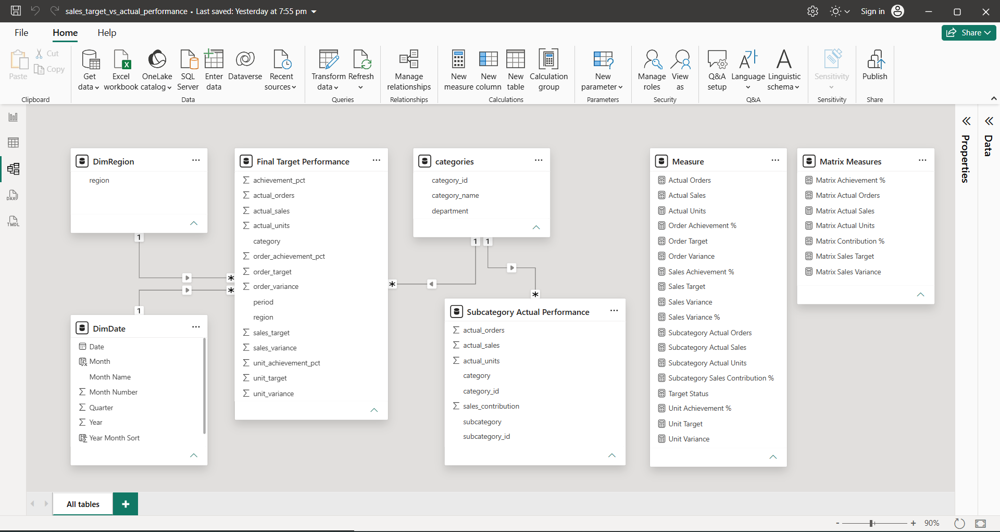
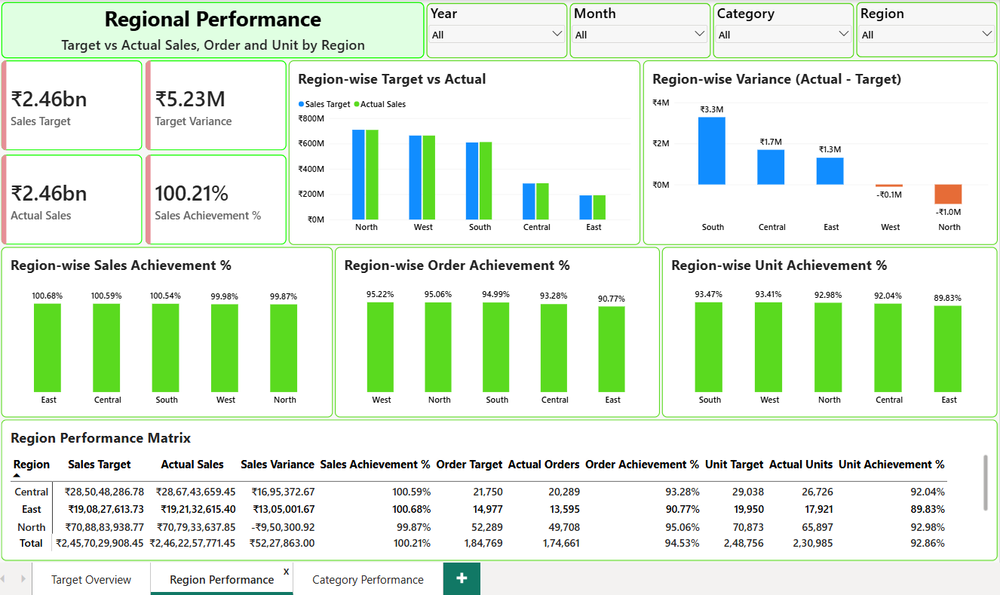
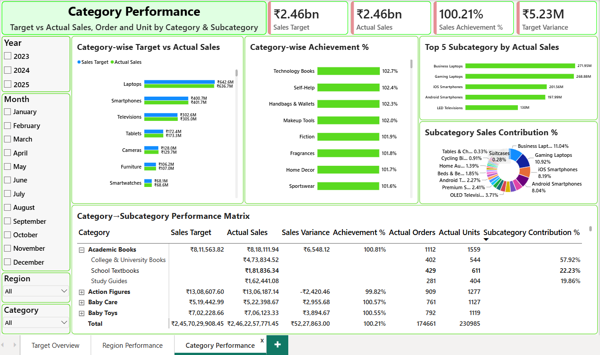

# Sales Target vs Actual Analysis (E-commerce)

**Tools:** PostgreSQL | SQL | Power BI | DAX

## 1. Project Overview

In this project, I analyzed e-commerce sales performance by comparing business targets with actual results. The main focus was to understand whether the business was meeting its sales targets and which regions and product categories needed improvement.

I used SQL to perform the analysis and prepare the final datasets. I then imported the SQL outputs into Power BI, created the data model and DAX measures, and built an interactive dashboard to present the results.

## 2. Project Objectives

- Compare sales targets with actual sales performance.
- Measure sales, order and unit target achievement.
- Analyze monthly sales performance and trends.
- Compare performance across regions and product categories.
- Identify regions and categories performing below target.
- Present the results through an interactive Power BI dashboard.

## 3. Business Questions

This project answers the following business questions:

1. Is the business meeting its overall sales targets?
2. How does sales performance change month by month?
3. Which regions are performing above or below target?
4. Which product categories contribute most to sales?
5. How do sales, order and unit achievement compare?
6. Which regions and categories need more attention?
7. How has sales target achievement changed over time?

## 4. Data Source

The data for this project comes from my e-commerce database and ETL project.

**Data Source Project:** [E-commerce Analytics Database ETL](https://github.com/anuragdwi811/e-commerce-analytics-database-etl)

The ETL project covers database preparation and data validation. For this project, I used the prepared database tables to perform business analysis and build the Power BI report.

The main tables used were:

- `sales.sales_targets` — sales, order and unit targets
- `sales.orders` — order dates and order status
- `sales.order_items` — sales revenue and quantities
- `master.customers` — customer regions
- `master.products` — product and category information
- `master.categories` — category details
- `master.subcategories` — subcategory details

## 5. Tools Used

| Tool | Purpose |
|---|---|
| PostgreSQL | Database queries and analysis |
| SQL | Data aggregation, target comparison and performance analysis |
| Power BI | Data modeling, reporting and dashboard development |
| DAX | KPI calculations and performance measures |

## 6. Project Workflow

The project followed these steps:

1. **Data Source:** Used the prepared e-commerce database from my ETL project.
2. **SQL Analysis:** Wrote queries to analyze monthly, regional and category-level target performance.
3. **Final SQL Output:** Prepared a final analytical dataset containing target and actual performance metrics.
4. **Power BI Import:** Imported the SQL outputs into Power BI.
5. **Data Modeling:** Created date, region, category and subcategory tables and configured the required relationships.
6. **DAX Measures:** Created measures for sales, orders, units, achievement percentages and variances.
7. **Dashboard Development:** Built three interactive dashboard pages.
8. **Business Insights:** Used the results to identify performance gaps and areas for improvement.

## 7. SQL Analysis

I created six SQL files to cover different parts of the analysis.

| File | Analysis |
|---|---|
| `01_target_vs_actual_monthly.sql` | Monthly target vs actual performance |
| `02_target_vs_actual_region.sql` | Region-wise target and actual performance |
| `03_target_vs_actual_category.sql` | Category and subcategory performance |
| `04_target_achievement_analysis.sql` | Target achievement classification and ranking |
| `05_underperformance_analysis.sql` | Underperforming regions and categories |
| `06_target_performance_summary.sql` | Final analytical dataset for Power BI |

### SQL Concepts Used

- Joins and Common Table Expressions (CTEs)
- Aggregate functions and `GROUP BY`
- Date-based aggregation
- `CASE` expressions for performance classification
- Window functions and ranking
- Target variance and achievement calculations
- `COALESCE` and `NULLIF` for handling missing actuals and zero targets

### Sales Calculation Rule

Only orders with the status `Delivered` were included when calculating actual sales, actual orders and actual units.

The target data was aggregated at the **Month + Region + Category** level. Actual performance was calculated at the same level for a fair comparison.

## 8. Power BI Development

### 8.1 Importing SQL Outputs

After completing the SQL analysis, I imported the following analytical datasets into Power BI:

- Final Target Performance
- Subcategory Actual Performance

These datasets were used to create the dashboard visuals and analyze business performance.

### 8.2 Data Modeling

I created and configured the following tables in Power BI:

- Final Target Performance
- Subcategory Actual Performance
- `DimDate`
- `DimRegion`
- `DimCategory`
- `DimSubcategory`

The relationships connect the analytical datasets with the relevant dimension tables. This helps organize the report and supports filtering and drill-down where the underlying data supports it.

The main target-performance dataset uses the Month + Region + Category grain. Subcategory analysis focuses on actual sales, orders, units and contribution because subcategory-level targets are not available.

### 8.3 DAX Measures

I created DAX measures to calculate the main performance indicators.

**Sales Measures**
- Sales Target
- Actual Sales
- Sales Achievement %
- Target Variance
- Sales Variance %

**Order Measures**
- Order Target
- Actual Orders
- Order Achievement %
- Order Variance

**Unit Measures**
- Unit Target
- Actual Units
- Unit Achievement %
- Unit Variance

These measures help compare actual performance with targets and understand the difference between revenue and sales volume.

## 9. Dashboard Pages

The Power BI report contains three pages.

### Page 1 — Target Overview

This page provides an overall view of business performance.

**Key components:**
- Sales Target
- Actual Sales
- Sales Achievement %
- Target Variance
- Monthly Target vs Actual Sales
- Monthly Sales Achievement %
- Monthly Variance
- Order vs Unit Achievement %

**Purpose:** To understand overall performance and track sales trends over time.

### Page 2 — Regional Performance

This page compares performance across business regions.

**Key components:**
- Region-wise Target vs Actual Sales
- Region-wise Sales Achievement %
- Region-wise Variance
- Region-wise Order Achievement %
- Region-wise Unit Achievement %
- Regional performance matrix

**Purpose:** To identify stronger regions and regions that need improvement.

### Page 3 — Category Performance

This page focuses on product category performance and subcategory-level actual results.

**Key components:**
- Category-wise Target vs Actual Sales
- Category-wise Achievement %
- Top 5 Subcategories by Actual Sales
- Subcategory Sales Contribution %
- Category and Subcategory performance matrix

**Purpose:** To compare product categories against targets and explore subcategory-level actual sales performance.

Subcategory-level target achievement is not calculated because the target data is available only at the category level.

## 10. Key Business Insights

The following insights were identified from the dashboard.

### 1. Overall Sales Performance

The business achieved approximately **100.21% of its overall sales target**, with actual sales of around ₹2.46 billion. The business finished slightly above its overall sales target.

### 2. Sales Performance Improved Over Time

Sales achievement improved from approximately 100.06% in 2023 to 100.39% in 2025. The positive sales variance also increased over this period.

### 3. Regional Performance Was Fairly Balanced

All five regions performed close to their sales targets. East, Central and South were above target, while West and North were slightly below target.

### 4. North Needs Attention

North achieved approximately 99.87% of its sales target and recorded a negative sales variance of around ₹0.95 million. Its order and unit achievement also indicate areas for improvement.

### 5. Sales Achievement Was Higher Than Order and Unit Achievement

Overall sales achievement was around 100.21%, compared with approximately 94.53% order achievement and 92.86% unit achievement. This suggests that revenue performance was stronger than sales volume performance and deserves further investigation.

### 6. Laptops Were the Largest Revenue Category

Laptops generated the highest sales among the categories analyzed, but actual sales remained slightly below target. Due to their large revenue contribution, even a small percentage gap created a meaningful shortfall.

### 7. Smartphones and Televisions Performed Well

Both categories achieved or exceeded their respective sales targets, helping offset some of the shortfalls in other categories.

## 11. Recommendations

Based on the analysis, the following actions could help improve performance:

- **Focus on North:** Review the categories, order volumes and unit performance contributing to the regional shortfall.
- **Review Laptop Performance:** Investigate product demand, pricing, availability and category mix.
- **Understand the Sales-to-Volume Gap:** Analyze average order value and product mix to understand why revenue achievement is higher than order and unit achievement.
- **Review Regional Patterns:** Compare South's relatively strong volume performance with East's stronger sales achievement but weaker order and unit achievement.
- **Monitor Repeated Underperformance:** Track regions and categories that remain below target across multiple months.
- **Track Multiple KPIs:** Review sales, orders and units together instead of relying only on revenue achievement.

## 12. Project Files

The repository contains the SQL analysis files, screenshots and supporting documentation.

```text
Sales-Target-vs-Actual-Analysis-Ecommerce/
│
├── README.md
│
├── sql/
│   ├── 01_target_vs_actual_monthly.sql
│   ├── 02_target_vs_actual_region.sql
│   ├── 03_target_vs_actual_category.sql
│   ├── 04_target_achievement_analysis.sql
│   ├── 05_underperformance_analysis.sql
│   └── 06_target_performance_summary.sql
│
├── screenshots/
│   ├── 01_target_overview.png
│   ├── 02_region_performance.png
│   ├── 03_category_performance.png
│   ├── 04_data_model.png
│   └── 05_sql_final_output.png
│
└── docs/
    ├── database_architecture.png
    └── target_analysis_flow.png
```

*Note: This structure represents the planned repository layout. Keep only the files and folders that are actually uploaded to GitHub.*

## 13. Conclusion

This project helped me analyze sales target performance using SQL and present the results through Power BI. By combining sales, order, unit, regional and category-level analysis, I was able to identify performance gaps and areas that need closer attention.

The project demonstrates my ability to work with a relational database, write business-focused SQL queries, build a Power BI data model, create DAX measures and turn analytical results into a business report.

## 14. Project Screenshots

### Dashboard — Target Overview



### SQL Final Output



### Power BI Data Model



### Regional Performance Dashboard



### Category Performance Dashboard


